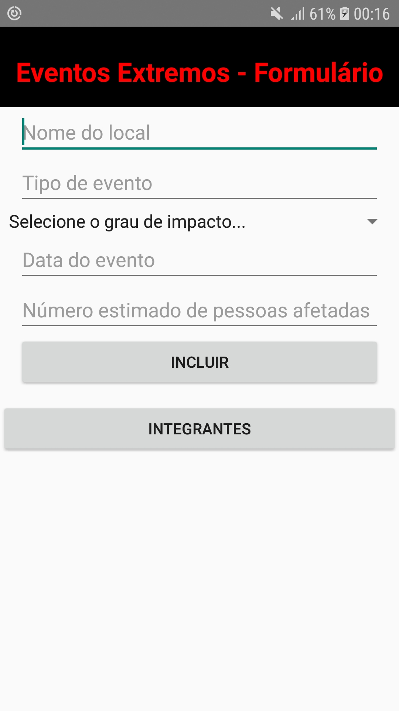
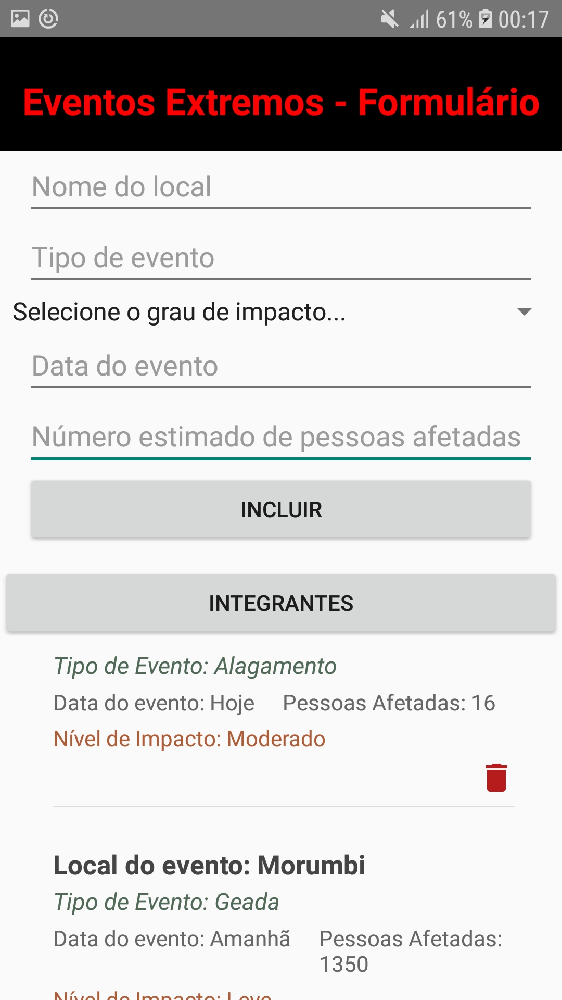
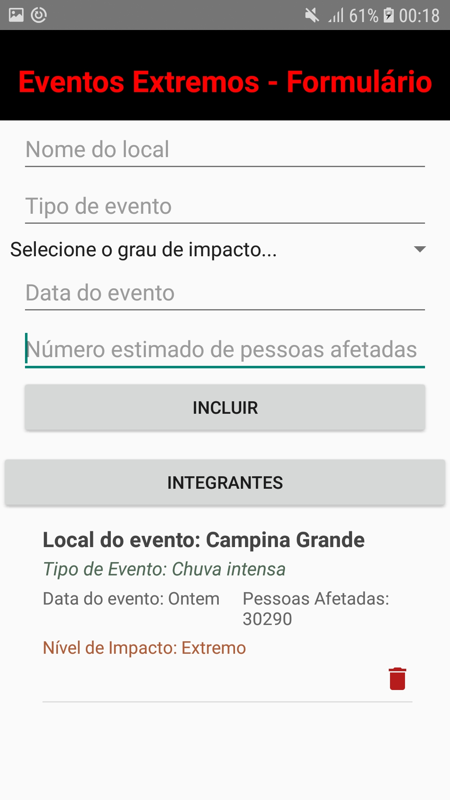
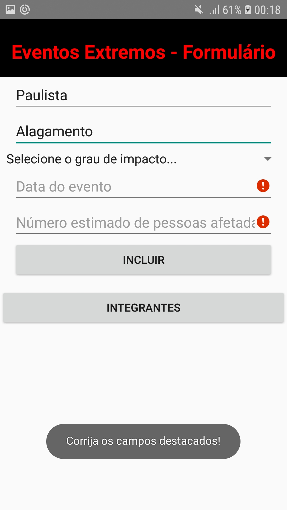
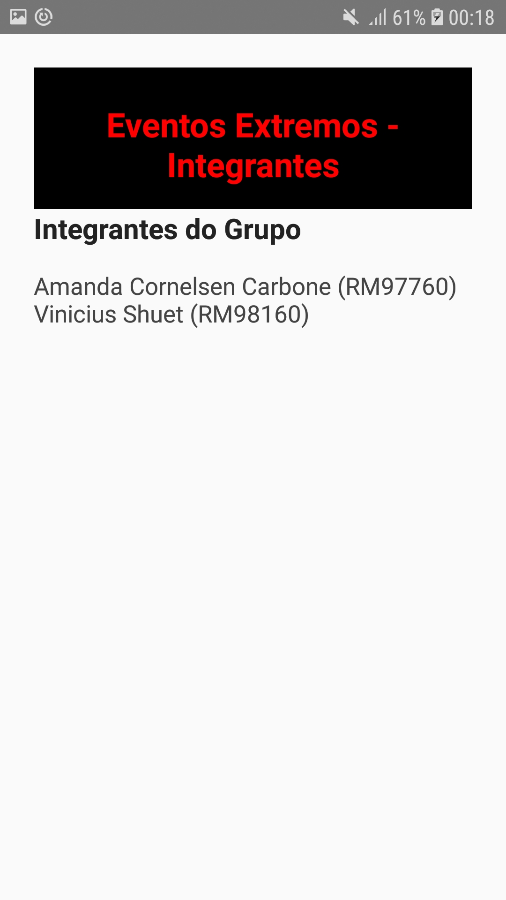

# GsKotlin1Semestre

## Alunos
### Amanda Cornelsen Carbone - RM97760
### Vinicius Shuet - RM98160  

## Imagens do projeto
#### Imagem 1 - 5 Edit Texts  
  
#### Imagem 2 - Adicionando Itens  
  
#### Imagem 3 - Excluindo itens  
   
#### Imagem 4 - Comprovando as exigências   
  
#### Imagem 5 - Integrantes   
  
